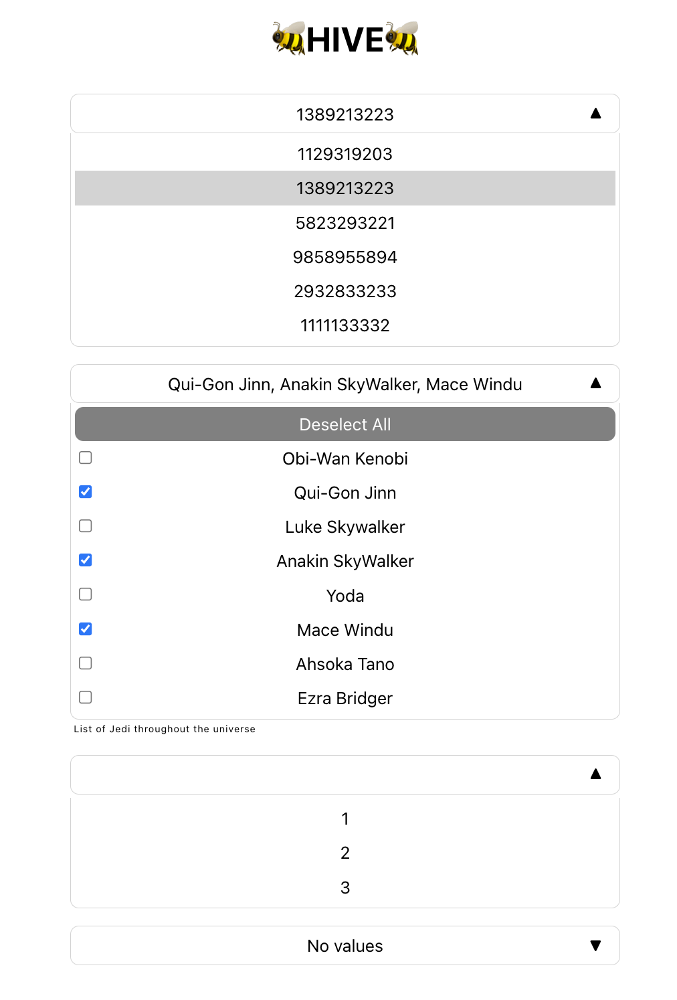

# Multi Select Component

## How to run this locally
Starts on port 3000.
```
yarn start
```

## How to run tests locally
```
yarn test
```

# Requirements

* open and close dropdown menu
* single select option
* multiple select option
  * select and deselect all options at once
* selected option(s) should be visible

# How to use

## Example

Look at `App.js` to see this example.



## MultiSelect

### Component Props

| Prop | Type | Required | Default | Description |
| ---- | ---- | -------- | ------- | ----------- |
| label | `string` | no | - | Label caption to appear below the multi select.
| multiple | `bool` | no | `false` | Set to `true` to enable multi select. Set to single select by default.
| title | `string` | no | - | Title when no options are selected.
| values | `Array` | yes | - | List of values to put in select.

# Improvements

* Allow selecting all checkboxes when some are selected. Right now, you must deselect all before selecting all.
* I would probably make these separate components due to all the conditionals within `MultiSelect.js`.
* After selecting a value, move the `selectTitle` up to the left like Material does it.
* Better styling.